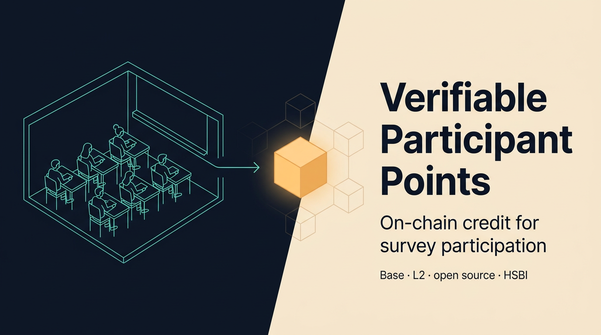

<p align="center">
  
</p>

<p align="center">
  <a href="https://github.com/hsbi-business-psychology/vpp-blockchain/actions/workflows/ci.yml"></a>
  &nbsp;·&nbsp;
  <a href="LICENSE"></a>
  &nbsp;·&nbsp;
  <a href="https://base.org/"></a>
  &nbsp;·&nbsp;
  <a href="https://doi.org/10.5281/zenodo.19845637"></a>
</p>

<h1 align="center">VPP — Verifiable Participant Points</h1>

<p align="center">
  An open-source credit system for university research that records survey
  participation on a public blockchain — tamper-proof, pseudonymous, and free
  for participants.
</p>

<p align="center">
  Built at <a href="https://www.hsbi.de/">HSBI · Hochschule Bielefeld</a>,
  designed to be adopted by any institution.
</p>

---

## Why it exists

Universities run hundreds of paid-credit studies every semester. The current
state is a mix of paper lists, Moodle plugins, and Excel sheets — easy to
manipulate, easy to lose, and entirely opaque to the students whose grades
depend on them.

VPP replaces that with a tiny smart contract on Base L2:

- **Verifiable.** Every point is a public on-chain transaction. Students,
  lecturers, and external auditors see the same source of truth.
- **Pseudonymous.** Points belong to wallet addresses, not student IDs. The
  system never stores names, emails, or matriculation numbers on-chain.
- **Frictionless.** Participants don't need crypto, gas, MetaMask, or even an
  account — a wallet is created in their browser the first time they claim.

## See it in 30 seconds

```bash
git clone https://github.com/hsbi-business-psychology/vpp-blockchain.git
cd vpp-blockchain && pnpm install
pnpm dev
```

`pnpm dev` boots a local blockchain, deploys the contract, seeds three test
surveys, and starts the API and frontend. Open <http://localhost:5173>, claim
the printed test link, and watch the points land on-chain in your browser.

## How it works

```
SoSci Survey   ──redirect──►   VPP Frontend   ──HMAC claim──►   VPP Backend
   (external)                  (React + wallet)                  (signs tx)
                                                                      │
                                                                      ▼
                                                          Base L2 · SurveyPoints
                                                          contract  (tamper-proof
                                                                     ledger)
```

Three components, all in this monorepo:

| Package                                    | Role                                                                |
| ------------------------------------------ | ------------------------------------------------------------------- |
| [`packages/contracts`](packages/contracts) | `SurveyPointsV2.sol` — UUPS-upgradeable, role-gated points ledger.  |
| [`packages/backend`](packages/backend)     | Stateless relayer. Validates HMAC claim tokens, signs the L2 tx.    |
| [`packages/frontend`](packages/frontend)   | React app. In-browser wallet, MetaMask support, lecturer dashboard. |

See [`docs/architecture.md`](docs/architecture.md) for the full data flow,
threat model, and key-management design.

## Tech stack

Solidity 0.8.24 · Hardhat · OpenZeppelin UUPS · ethers v6 · Node 20 · Express ·
React 19 · Vite 6 · Tailwind v4 · shadcn/ui · i18next · Vitest · Hardhat-Chai.

Runs on Base mainnet for production, Base Sepolia for staging, and a local
Hardhat node for development.

## Cost

A semester of 4 studies × 200 students costs roughly **2 € in gas**. Contract
deployment is a one-time 0.50 €. Reads are free. Full breakdown in
[`docs/deployment.md`](docs/deployment.md).

## Documentation

Everything is under [`docs/`](docs/):

| Topic                                                                           | What's in it                                           |
| ------------------------------------------------------------------------------- | ------------------------------------------------------ |
| [Getting started](docs/getting-started.md)                                      | Local setup, test accounts, walkthrough.               |
| [Architecture](docs/architecture.md) · [Smart contract](docs/smart-contract.md) | System design, on-chain model, upgrade story.          |
| [Security](docs/security.md)                                                    | Threat model, key handling, replay protection.         |
| [SoSci integration](docs/sosci-integration.md)                                  | Drop-in survey templates with HMAC claim links.        |
| [Deployment](docs/deployment.md) · [Runbooks](docs/runbooks/README.md)          | Production deploy, key rotation, incident response.    |
| [For universities](docs/for-universities.md)                                    | Adoption guide for other institutions.                 |
| [ADRs](docs/adr/README.md)                                                      | Long-form rationale for major design decisions.        |
| [Audit V2](docs/audit/v2/)                                                      | Independent security audit, master findings, go/no-go. |

## Contributing & operating

- Branch protection, review rules, and the `gh` setup are in
  [`CONTRIBUTING.md`](CONTRIBUTING.md). New instances should run
  [`scripts/setup-branch-protection.sh`](scripts/setup-branch-protection.sh)
  before going live.
- Vulnerability reports → [`SECURITY.md`](SECURITY.md).
- Community standards → [`CODE_OF_CONDUCT.md`](CODE_OF_CONDUCT.md).
- Release history → [`CHANGELOG.md`](CHANGELOG.md).

## Citing VPP

If you use VPP in academic work, please cite the software via the
[`CITATION.cff`](CITATION.cff) file. The persistent identifier that
resolves to the latest release is
[`10.5281/zenodo.19845637`](https://doi.org/10.5281/zenodo.19845637).
The version-specific DOI for the snapshot described in the
accompanying _Behavior Research Methods_ manuscript is
[`10.5281/zenodo.19845636`](https://doi.org/10.5281/zenodo.19845636)
(GitHub tag `paper-v1`).

The de-identified usability evaluation data set and the analysis
script that reproduces every reported number live under
[`docs/paper/data/`](docs/paper/data/) and are included in the Zenodo
archive.

## License

[MIT](LICENSE) — fork it, run it, write a paper about it. If you adopt VPP at
your institution, we'd love to hear about it.
